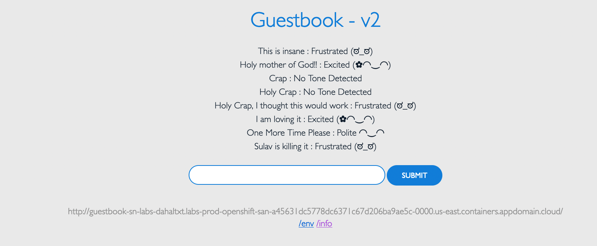

# OverView

This is a simple guestbook application to demonstrate the concepts of Docker, Kubernetes and Openshift.It is a multi-tier web application that consists of a web front end, a Redis master and replicated slaves for storage, as well as an analyzer service that analyzes the tone of entries left in the guestbook. A free instance of Tone Analyzer from IBM Cloud account is utilized to make it working.

# Purpose

The purpose of this application is to understand to create a multi tier version of the guestbook application, roll out updates using OpenShift image stream, use cloud services, create and apply Kuberentes objects, utilize Docker Container to create container images, understand replicaSet, and perform Horizontal AutoScale.

# Preivew Of the Application

# Development Environment

1. IBM Cloud Services -- Natural Language Translation
2. Docker Container
3. OpenShift
4. Kubernetes
5. Visual Studio Code

Note -- This Project is part of IBM DevOp's and Software Engineering Program
